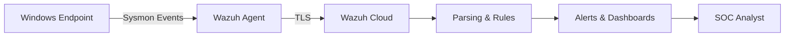

# SOC Project 1 — Windows Sysmon + Wazuh Cloud

[](https://github.com/nwsf1/SOC_Project_1_Windows_Sysmon_Wazuh)
[]
[]
[]

End-to-end SOC detection pipeline: Sysmon telemetry → Wazuh Cloud ingestion → custom detection rules → validation.

---

## Table of contents
- [Overview](#overview)
- [Quick start](#quick-start)
- [Architecture](#architecture)
- [Detection lab](#detection-lab)
- [Configs & rules](#configs--rules)
- [Reports & evidence](#reports--evidence)
- [Contributing](#contributing)
- [License & contact](#license--contact)

---

## Overview
This repo demonstrates a compact SOC pipeline for Windows endpoints using Sysmon and Wazuh Cloud. It includes example detection rules, lab scenarios used to validate those detections, and mapping to MITRE ATT&CK.

---

## Quick start
Prerequisites:
- A Windows test VM (Win10/11)
- Sysmon installed with `configs/sysmon.xml`
- Wazuh agent configured to forward to Wazuh Cloud

Minimal test (Encoded PowerShell):
1. On the Windows test VM, run (PowerShell):

```
powershell.exe -NoProfile -WindowStyle Hidden -EncodedCommand <payload>
```

Expected:
- Sysmon Event ID 1 (Process Create)
- Wazuh rule `900001` triggers

DNS beaconing (quick test):

```
while ($true) { Resolve-DnsName "c2.example.test"; Start-Sleep -Seconds 5 }
```

Expected:
- Sysmon Event ID 22 (DNS Query)
- Wazuh rule `900003` triggers

Detailed walk-throughs and logs are in `detection-lab/`.

---

## Architecture



---

## Detection lab
See `detection-lab/` for full scenarios, sample logs, and guidance on reproducing tests.

---

## Configs & rules
Custom rules live in `configs/custom-rules.xml`. Below is a short excerpt for quick reference:

```xml
<!-- configs/custom-rules.xml (excerpt) -->
<group name="Sysmon Rules">
  <rule id="900001" level="10">
    <if_sid>1</if_sid>
    <description>Encoded PowerShell execution (T1059.001)</description>
    <match>
      <field>CommandLine</field>
      <contains>-EncodedCommand</contains>
    </match>
  </rule>
</group>
```

---

## Sample outputs
Sysmon (Process Create) example:

```json
{
  "EventID": 1,
  "UtcTime": "2026-01-15T12:34:56.000Z",
  "Image": "C:\Windows\System32\WindowsPowerShell\v1.0\powershell.exe",
  "CommandLine": "-EncodedCommand AAAAA..."
}
```

Wazuh alert example:

```json
{
  "rule": { "id": 900001, "level": 10, "description": "Suspicious PowerShell encoded command detected" },
  "agent": { "id": "win-vm-1", "name": "win-vm-1" },
  "timestamp": "2026-01-15T12:35:10.000Z"
}
```

---

## Reports & evidence
- `reports/` — Project-Summary.md, SOC-Incident-Report.md, MITRE-Mapping.md, Triage-Notes.md
- `screenshots/` — Dashboard and alert screenshots

---

## Contributing
1. Fork the repo
2. Create a branch
3. Add scenarios, rules, or docs and include test evidence
4. Open a PR with a clear summary

---

## License & contact
This repository is provided as-is for educational/portfolio purposes. Contact via GitHub Issues or the email on my profile.

---

(End of file)